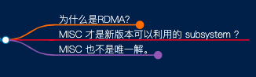
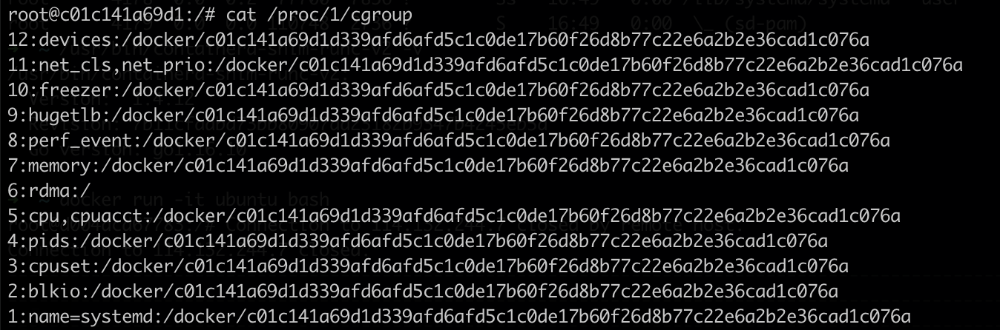
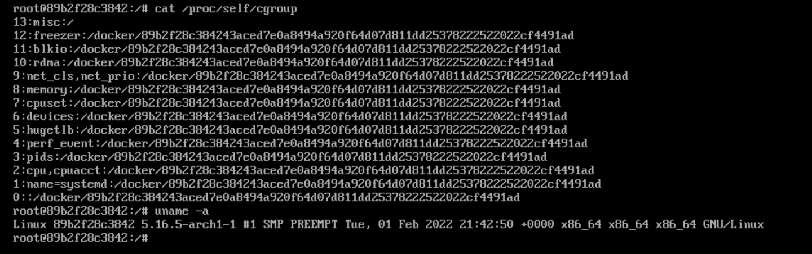
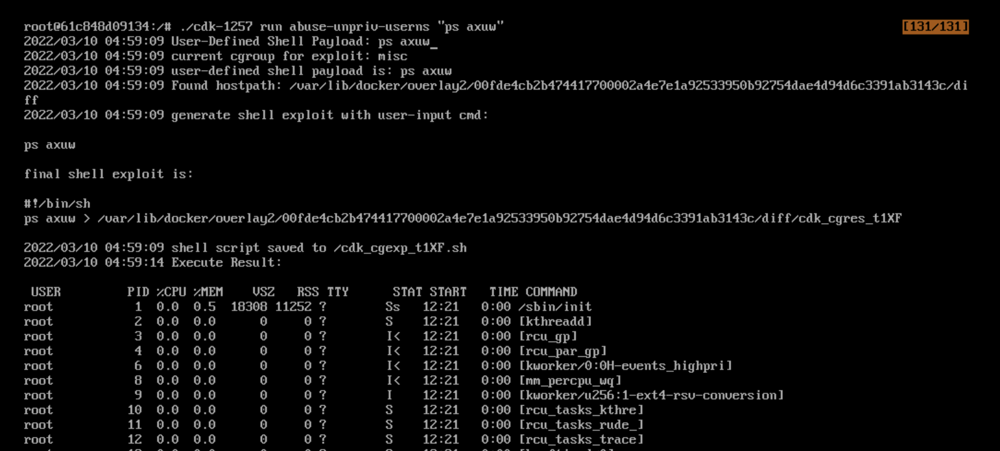
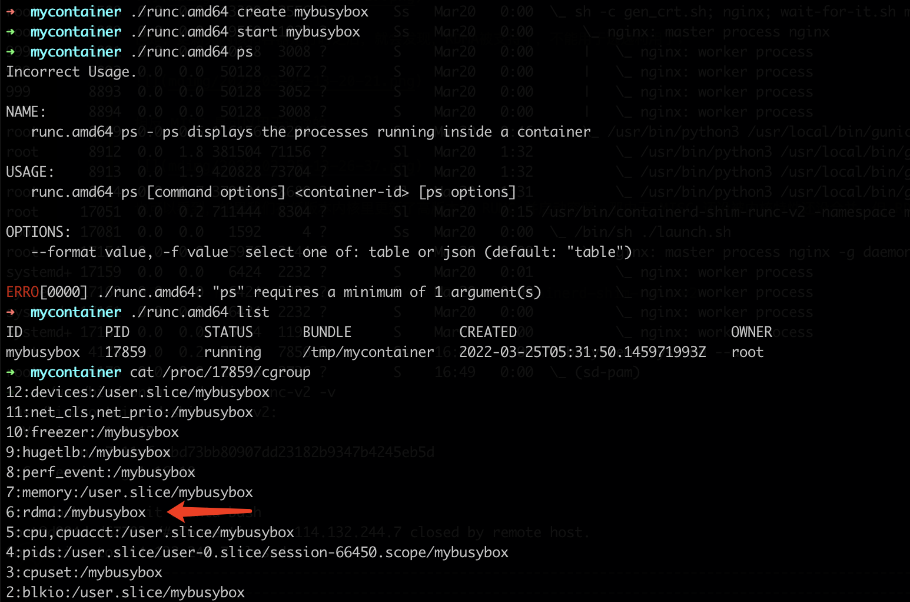
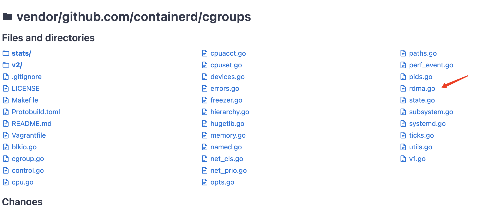
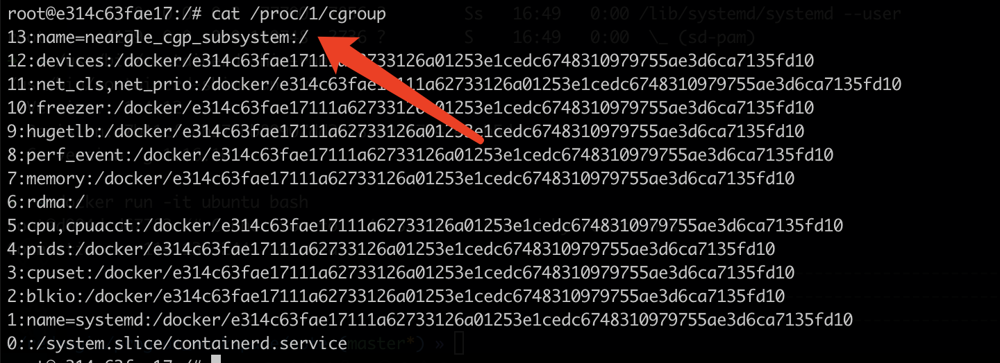

# 内核实现之外，CVE-2022-0492被忽视的关键点

CVE-2022-0492在业界的热度很高，我陆陆续续看了很多不错的选手都发表了这个漏洞的分析文章；
但由于工作TODO事项太多，我都是挑一下关键内容过了一下就没细读了，有点可惜。

有很多同学写的很细致，很用心，但大部分都把这个漏洞关键聚焦在Kernel的实现和已公开的EXP上，但另外一个关键点 container runtime 的实现上，却目前没见到文章有提及。

***注：3号看 PaloAltoNetworks 文章(https://unit42.paloaltonetworks.com/cve-2022-0492-cgroups/)跟进分析时，我就直拍大腿，这不是都是常识吗，去年离这个漏洞就差临门一脚。现在就来讲讲这一脚。已经理解我们EXP代码和文档理解的师傅可以跳过到最后一块了。文档见： https://github.com/neargle/cdk_document/blob/master/Exploit:-abuse-unpriv-userns.md***

## 为什么是RDMA？

很多同学在分析漏洞的时候，都会提到

> 默认只有rdma group子系统控制器合适利用

这句话其实是不全面的，在CVE-2022-0492这个漏洞的利用上，RDMA在Kernel层面的实现和其他子系统并没有明显的区别。

甚至，如果把 Kernel 升级到 5.13 以上，再升级一下 Docker，就会发现这个漏洞 RDMA 就不能逃逸了，MISC才是默认可以逃逸的子系统。

## MISC 才是新版本可以利用的 subsystem ？

其实，不难发现，RDMA 可以用于逃逸是因为在老版本的容器运行时组件在跟进 Linux Kernel 4.11 的实现时，没有及时跟进支持 RDMA 的实现，所以我们在容器内查看CGROUP配置的时候， RDMA 为 ROOT，其他子系统就不是。

但是，更新完内核和容器运行时之后，就会发现，RDMA被支持了，不能用于逃逸利用了；

相反 MISC 是可以用于逃逸的。

也可以看到，如果我们在低版本内核里更新了高版本的 RUNC 并启动容器，那由于 MISC 还没被内核特性还没合并，但 RDMA 已经被 RUNC 支持了，所以容器内的 CGROUP 子系统都不为根，也就难以直接利用了。

这里无论是 runc 还是目前 docker 和 K8s 更常用的 containerd-shim-runc-v2，又或者其他容器运行时组件，其实 CGROUP 管理上都广泛复用（复制）了一个实现。这个实现里，直至最新版本，都还未跟进支持 MISC。

## MISC 也不是唯一解。

所以，能利用的子系统，就得满足了两个条件：

1. 操作系统支持的子系统，一般是 Kernel 的实现，会一直迭代新的子系统特性，如 Linux Kernel 4.11 新增 RDMA；5.13 支持 MISC。
2. 容器运行时组件里还没有做支持，直接挂载根，且没有其他限制的；

那就有一个非预期解了，其实除了 Kernel， 一些常见的组件也会自己搞一些子系统，例如 systemd，又或者安全研究员调试时的瞎搞和自研工具的作死。

那这些子系统，在容器内也是 ROOT，就也能用于逃逸利用；我们的利用代码也兼容了这种情况。

所以，这里后面再出个逻辑漏洞我肯定不惊讶，群友们卷起来。只是希望不要是最近，我没时间看了。
