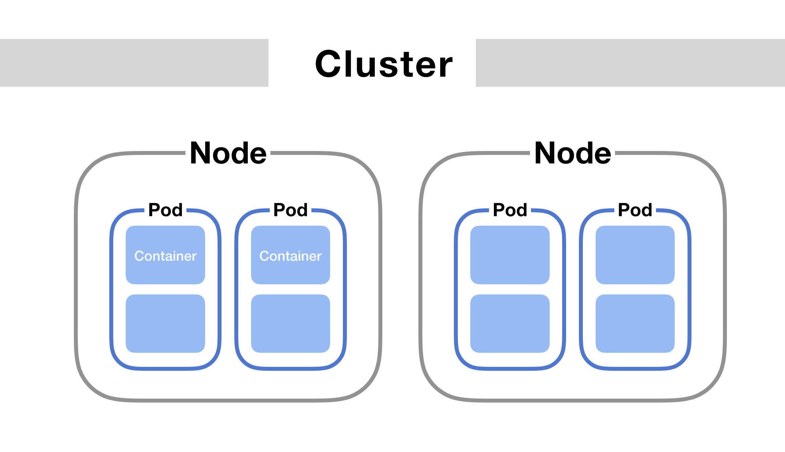
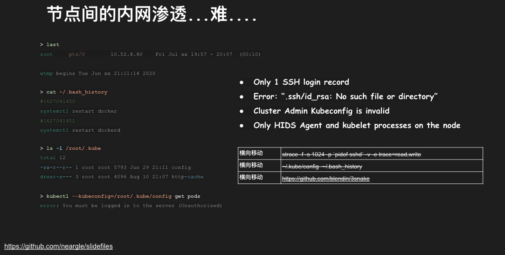
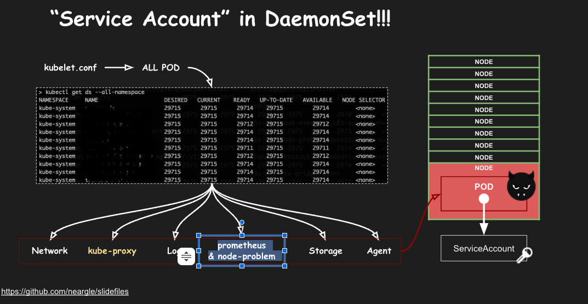
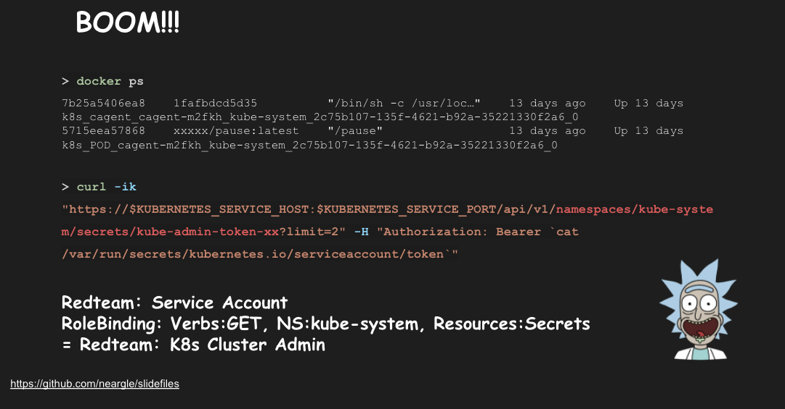
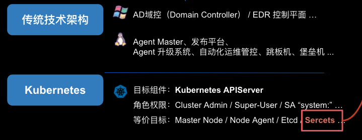
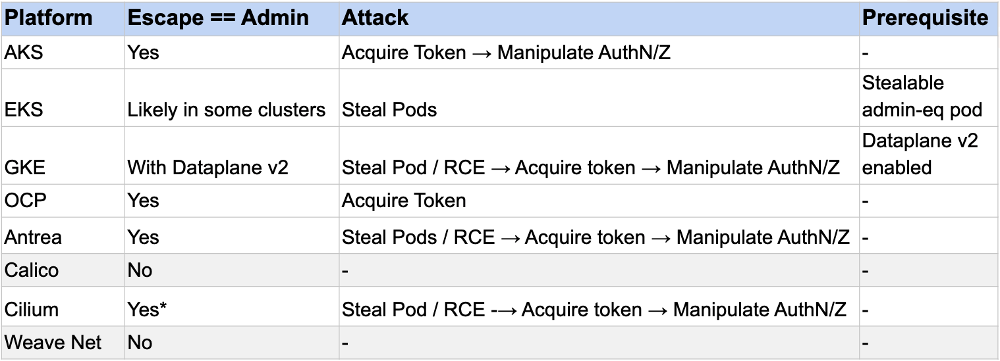

# 如何从 Kubernetes 节点权限提升至集群管理员权限？

我有幸参加了去年的 KubeCon 并分享议题，议题的其中一个攻防案例讲述了如何从一个边缘业务的开发者权限逐步提升至 Kubernetes 集群管理员权限；其中最后一步的手法，是描述关于节点上利用 DaemonSet 和 Pod 上的 ServiceAccount token 进行提权，那一年我在补天上的议题也简述了这个手法。在今年的 KubeCon 欧洲上，这样的攻击手法被命名为了"蹦床"，快速过完国外的这篇 slide 之后，深感他们研究的细致和用心，对比我去年的形色匆匆熬夜赶稿，他们倾注了更多的时间和资源，完成了我的很多遗憾和不甘；也让我重拾了这块研究的很多记忆。
诶，很多TIPS捂着捂着就捂坏了，再熬夜通宵写完这篇稿子吧。

以下内容和此前我在师傅们的星球发的内容并无二致，我把历史上这块相关的分享都汇总到了 https://github.com/neargle/my-re0-k8s-security , 用于知识整理、勘误和迭代，用来避免各平台不方便修改内容的问题。

## Kubernetes集群下的横向移动

本质上，今天要讲的技巧和手法就是攻防中经典环节：横向移动；只不过在 Kubernetes 节点中的横向移动有一些新的技巧和手法，更加通用、危害也更大。

  
*图引用自： https://ithelp.ithome.com.tw/articles/10262662*

本文涉及的横向移动手法一般发生于 Kubernetes 的节点上，即红队已经获取了 Kubernetes 集群的一台服务器权限，并以当前的服务器为起点横向移动控制更多的服务器，从而通往靶标；这里最直接的方法就是找机会把自己的权限从节点权限提升到集群管理员（cluster admin）权限，拥有控制 Kubernetes 集群任意资源的能力。

当然，除了直接提升到 Cluster admin，我们也经历过比较曲折需要一步步提权的渗透过程；例如：
* 从节点A控制节点B上的Pod和容器，再逐步提升至 Cluster admin；
* 从节点A控制节点B整个服务器，再逐步提升至 Cluster admin；
* 把当前节点的POD通过 nodeSelector lable 等配置迁移到其他节点，继续渗透该节点，再逐步提升至 Cluster admin；
* 从节点A获取控制 Service、Ingress 等资源的权限，拥有管控东西向或南北向流量的能力，然后利用 Ingress-nginx CVE-2021-25742 的漏洞提升到 Cluster admin；
* 修改 ServiceAccount 的权限绑定、查看更多Secret秘钥、甚至集群内的中间人攻击（如利用 CVE-2020-8554 漏洞）等等

但是都会经常和 ServiceAccount 的利用手法打交道，也就是 Palo Alto Networks 研究员所说的 “蹦床” (Trampoline) 手法。

## 可能"蹦床"手法并无必要

不过其实大部分情况下，红队无需了解 ServiceAccount 也能完成横向移动目标。现在的集群管理员有很多坏毛病，比如有些集群管理员会在每个节点的 ~/.kube/config 或其他目录放置集群管理员的 kubeconfig 文件方便运维；只要 find 一下，我们就能获取 Kubernetes 的集群管理员权限。

同时，如果集权管理员不遵守节点上的运维规范，传统的横向移动手段也依然适用，包括但不限于：
* 服务器上监听的端口存在RCE漏洞
* 节点上放置了可以登录其他服务器的 SSH 私钥
* 获取 SSH 密码，如 本地信息收集、strace、sudo钓鱼等
* 节点 Agent 的漏洞挖掘
* 用漏洞攻击自动化运维管控系统、跳板机、堡垒机、密码库、发布平台等

当然，Kubernetes集群对于攻防来说，最大的变化之一就是把业务和应用的可执行能力，从服务器上限制到一个个POD中，业务代码和运维原则上并不会拥有控制节点的能力，也无法影响到节点服务器。所以，如果是标准且原生的线上集群，集群管理员是不会登录到各个节点上进行运维的，也不会留下很多痕迹和攻击入口。

## DaemonSet 和 ServiceAccount

这个手法的核心需要理解 DaemonSet 和 ServiceAccount 的设计，其中 DaemonSet 经常被集群管理员用来运维和管理节点，也得到了很多云原生安全 Agent 的青睐。之所以这个手法比较通用，是 DaemonSet 和 ServiceAccount  有两个默认特性：

**1、当集群管理员新建一个 DaemonSet 资源时，每个节点上都会运行一个由 DaemonSet 管理的 POD 实例副本；**

因为这样的特性，我经常用 DaemonSet 兼岗运维来帮集群管理员处理一些安全问题，例如我就经常使用下面的 DaemonSet 帮忙清理集群下所有服务器的 SSH 私钥、配置文件、日志等敏感信息；因为业务都跑在 POD 上，POD Security Policy 规范了 POD 的挂载和权限，所以一般也不用担心业务因为节点上的文件清理而故障。这样的运维方式，也可以让节点上的运维组件进一步减少，一定程度上减少了攻击面。

```yaml
apiVersion: extensions/v1beta1
kind: DaemonSet
spec:
... 
template:
  metadata:
    labels:
  spec:
    containers:
    - image: busybox
      command:
      - sh
      - -c
      - rm /ssh/.ssh/id_rsa
      name: rm
      volumeMounts:
      - mountPath: /ssh
        name: root
    volumes:
    - hostPath:
        path: /root
        type: Directory
      name: root
```

注：该 DaemonSet 会删除集群下所有节点上 root 用户的 SSH 私钥（默认路径下）。

**2、每个 POD 在新建时都会绑定一个 ServiceAccount，每个 ServiceAccount 可以拥有一个或多个 Secret，默认存放在容器里的 /var/run/secrets/kubernetes.io/serviceaccount 目录下。**

那么，假如集群管理员给一个 DaemonSet 绑定了一个 ServiceAccount，并修改这个 ServiceAccount 的 RBAC 设置，给他等同于 Cluster Admin 的权限。

那么，当我们控制了一台节点服务器时，由于 DeamonSet 会在每一台节点服务器上创建一个 POD 副本，所以无论我们控制了集群中的哪一台服务器，都可以提升至集群管理员的权限，也等于可以控制当前集群下所有节点的服务器，可控集群里的任意资源了。

## 此前的权限提升案例

### 1. 服务器本地信息收集

  

我在 KubeCon 分享的案例就是类似的情况，当我们通过容器逃逸获取了一台服务器的权限后，我们发现这台服务器上很多有趣的情况：
* 这台服务器只有一条远久的 SSH 登录记录
* 节点上的 history 等日志文件少得可怜，几乎没有什么有用信息
* 节点上的秘钥文件已经全部被清理
* 节点上除了 HIDS Agent 之外，没有其他用于运维的组件
* 等等

当然，这不代表以前我们积累下来的横向移动手法都不可行了，但 Kubernetes 的集群架构确实让 RCE 后的本地信息收集少了很多遇到惊喜的可能性。

### 2. 分析 DeamonSet

  

通过分析节点上正在运行的 POD，同时 Kubelet 默认也包含查询集群内其他节点 POD 的权限，我可以得知当前的集群里使用了以下几类 DeamonSet：
1. 网络管理和CNI插件
2. kube-proxy
3. 日志组件
4. prometheus & node-problem 运维监控
5. 存储组件
6. 安全 Agent

其中，kube-system/kube-proxy 是 Kubernetes 的默认设计，他的 ServiceAccount 一般不做修改，利用价值有限。

### 3. 提权

  

最终我们发现其中一个 DaemonSet: 安全 Agent，其配置文件里给 ServiceAccount 设置了 RBAC 权限，绑定了一个权限较大的 Cluster role，并且可以 list 和 get secret 信息。虽然，其他 DaemonSet 的 ServiceAccount 也设置了不同 RBAC 权限，但当我们拥有了 kube-system 命名空间下的 Secret 权限时，我们就等同拥有了 K8s Cluster Admin 的权限。也由于我们本次的靶标在集群内，所以最终我们达成了目标。

（画外音：这个 DaemonSet 还配置了很多重复且杂七杂八的 Capability，安全 Agent 配置特定的 Capability 来提升权限并不少见，但研发者可能并不能很好的把握每个 Capability 的作用，有些甚至配置了特权容器以求方便。由于 DaemonSet 的配置不会经由 PodSecurityPolicy 或 K8s Admission Webhook 所限制，权限过大和权限滥用的情况还是比较多的，建议集群管理员也注意此处的权限收敛。

这里红队朋友们可以使用一条简单的命令来测试当前的服务器上的所有容器的 ServiceAccount 是否拥有列举 Secret 的权限，比较好的方式是使用 kubectl auth can-i 来检测，但节点和POD上一般不安装 kubectl，所以我更倾向用 curl 进行简单测试。

``` bash
docker ps | grep -v "/pause" | awk -F" " '{print $1}' | grep -v CONTAINER | while read line; do echo $line; docker exec -t $line sh -c 'curl -k "https://$KUBERNETES_SERVICE_HOST:$KUBERNETES_SERVICE_PORT/api/v1/namespaces/kube-system/pods?limit=2" -H "Authorization: Bearer `cat /var/run/secrets/kubernetes.io/serviceaccount/token`"'; done;
```

当然，这个方法并不优雅；熟悉我的同学知道我还维护了一个容器安全工具 [📦 CDK](https://github.com/cdk-team/cdk)，集成了很多容器和Kubernetes安全测试的特性；有一个功能“检测节点上 ServiceAccount 可用于提权的权限”一直躺在我的 TODO 里，但一直没得空去实现出来，欢迎PR，或者催我更新😭

除了列举和查看 secret 的权限，还有很多集群内的目标和权限与 Cluster Admin 等价，我之前画了一张图可以作为参考：

  

## 锅不能全给集群管理员

看到这里，大家可能会认为这里问题主要是集群管理员的错误配置导致的。其实不然，很多集群在从云厂商购买下来的时候就已经内置了一些 DaemonSet，用来增强集群和节点上的能力，提升运维和网络通讯的效率；这里不乏错误配置的情况，AKS(微软), EKS(AWS), GKE(Google), OpenShift 此前都有这样的问题，轻则可以控制POD，重则可以提权至 Cluster Admin 权限；同时像 Antrea, Calico, Cilium, WeaveNet 这些应用广泛的 CNI 插件也存在可以提权至 Cluster Admin 权限的问题；不过现在都修的差不多了，这块 Palo Alto Networks 的研究员们梳理的最好，大家可以看他的结果。

  

这块也是我去年的意难平呀，可惜当时没钱也没时间搞，其实是一个很不错的 bugbounty IDEA。国内的平台估计也会有同样的问题，不过国内的漏洞赏金计划对集群内的权限提升问题并不关注，所以给到的奖励会比较有限，我就不一一去测了；如果那家的师傅觉得可以给到不错的赏金可以和我说一下，我来试试看能不能找到可以提权的点。

我历史的PPT可以在 https://github.com/neargle/my-re0-k8s-security/tree/main/slide 查看，我把 Palo Alto Networks PPT 也附在文末了，大家可以参考。

除了 CNI 插件和安全组件，日志组件的 DaemonSet 默认配置也经常配置过大的权限和挂载过大的目录，如很多人使用 filebeat 配置：

```yaml
apiVersion: apps/v1
kind: DaemonSet
metadata:
  name: filebeat-logsystem
  namespace: kube-system
  labels:
    k8s-app: filebeat
spec:
  template:
    metadata:
      labels:
        k8s-app: filebeat
    spec:
      serviceAccountName: filebeat
      terminationGracePeriodSeconds: 30
      hostNetwork: true
      dnsPolicy: ClusterFirstWithHostNet
      containers:
      - name: filebeat
        image: docker.elastic.co/beats/filebeat:%VERSION%
        args: [
          "-c", "/etc/filebeat.yml",
          "-e",
        ]
        env:
        - name: ELASTICSEARCH_HOST
          value: elasticsearch
        - name: ELASTICSEARCH_PORT
          value: "9200"
        - name: ELASTICSEARCH_USERNAME
          value: elastic
        - name: ELASTICSEARCH_PASSWORD
          value: changeme
        - name: ELASTIC_CLOUD_ID
          value:
        - name: ELASTIC_CLOUD_AUTH
          value:
        - name: NODE_NAME
          valueFrom:
            fieldRef:
              fieldPath: spec.nodeName
        securityContext:
          runAsUser: 0
          # If using Red Hat OpenShift uncomment this:
          privileged: true
        resources:
          limits:
            memory: 200Mi
          requests:
            cpu: 100m
            memory: 100Mi
        volumeMounts:
        - name: logpath
          mountPath: /hostfs/
      volumes:
      - name: logpath
        hostPath:
          path: /
```

归根结底，还是最小权限原则的问题。老生常谈了，但在 Kubernetes 的实践里却又有很多新的东西需要安全从业者们去把握。
